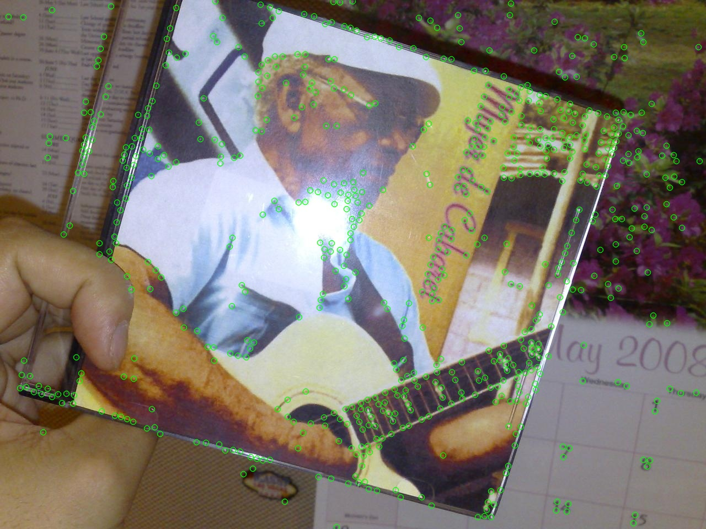
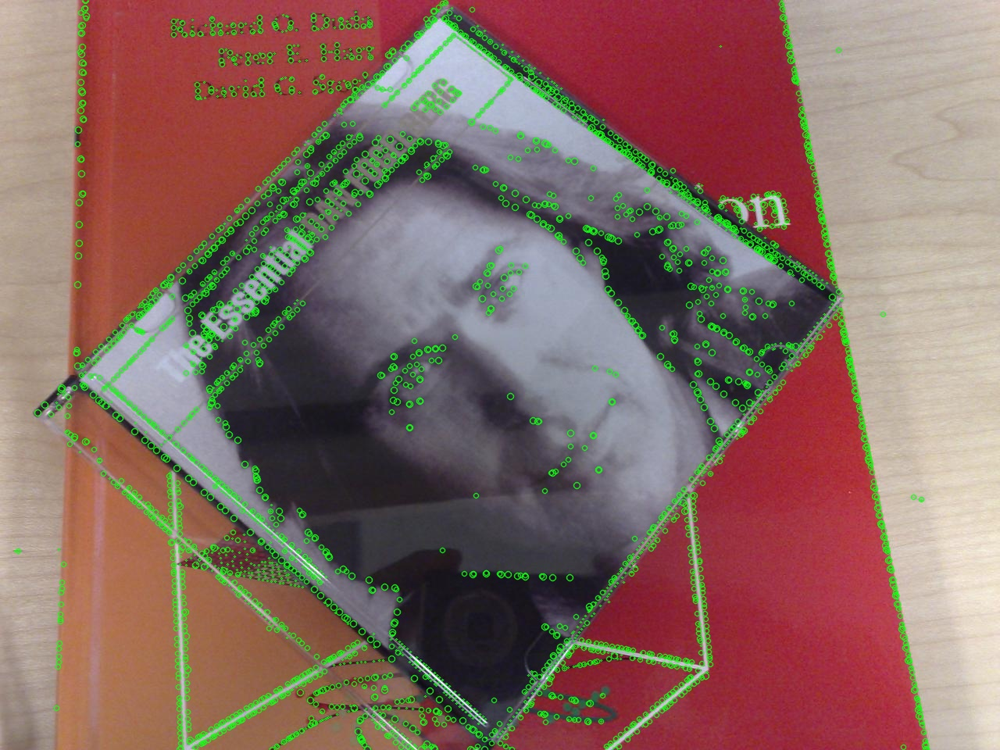
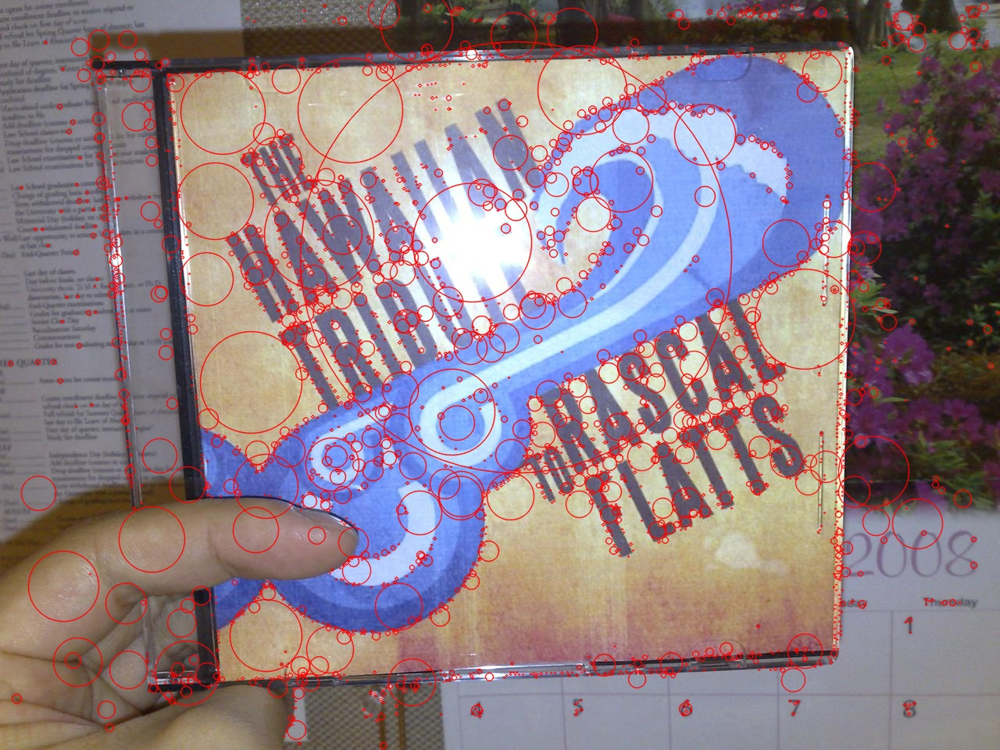
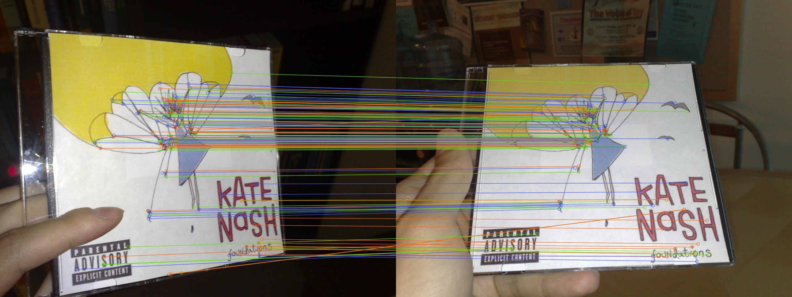

# |HCMUS|

**us579 | Project in Subject Computer Vision**

## Introduction

This is a C++ implementation of [Harris](https://en.wikipedia.org/wiki/Harris_corner_detector), [Blob-LoG](https://en.wikipedia.org/wiki/Blob_detection), [DoG](https://en.wikipedia.org/wiki/Difference_of_Gaussians), detection feature point algorithm.
And [SIFT](https://en.wikipedia.org/wiki/Scale-invariant_feature_transform), matche feature point.

## Libraries used

[opencv](https://opencv.org/) I bulid algorithms with C++ and opencv
You can setup opencv in Visual Studio here: https://www.youtube.com/watch?v=unSce_GPwto&pp=ygUcdXNlIG9wZW5jdiBpbiB2aXN1YWwgc3R1ZGlvIA%3D%3D

## Usage example

Find feature point and show result:

**Use harris**

```bash
feature_points.exe <path_image> harris
```

Result:

**Use blob**

```bash
feature_points.exe <path_image> blob
```

Result:

**Use dog**

```bash
feature_points.exe <path_image> dob
```

Result:

Match features in two images and show the result::
**Use SIFT**

```bash
feature_points.exe <path_image_1> <path_image_2> sif <detector>
```

Parameter <detector>:

- 1: use harris
- 2: use blob
- 3: use dog
  Result:
  

[You can see another example image here](https://studenthcmusedu-my.sharepoint.com/:f:/g/personal/20120579_student_hcmus_edu_vn/EnKbnfGBcM5ChraEqkTFX4YBGPEDBuyrjoTKdXMIVMUMGQ?e=jq8bbH)

## Useful links

- You can find more information about them in report.pdf
